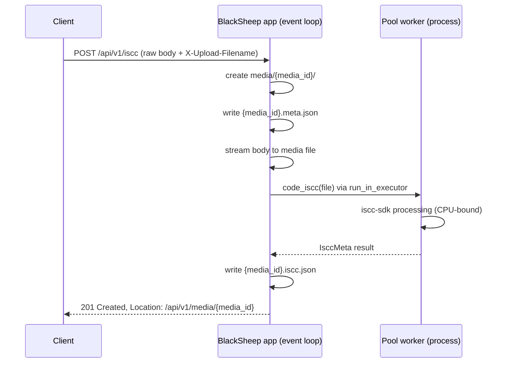

# Architecture

`iscc-web` is a Python ASGI microservice built on
[BlackSheep](https://github.com/Neoteroi/BlackSheep) that wraps `iscc-sdk` for ISCC generation,
plus a Vue 3 demo SPA served by the same process. The
design rests on three decisions: the REST API is defined contract-first in an OpenAPI document, all
I/O runs async on the event loop, and CPU-bound ISCC processing is pushed into a pool of worker
processes so the event loop never blocks.

## OpenAPI-first API layer

`iscc_web/static/docs/openapi.yaml` is the source of truth for the REST API. Everything else derives
from it:

- **Generated models** — `iscc_web/api/schema.py` is generated from the spec with
    datamodel-code-generator (`uv run poe codegen`, pydantic v2 output) and is never edited by hand.
    Controllers import their request/response models from this module.
- **Served documentation** — the spec is served at `/docs/openapi.yaml`, and `/docs` renders it as
    interactive API documentation (Stoplight Elements).
- **Conformance tests** — `tests/test_api_schemathesis.py` runs schemathesis property-based tests
    against a live server instance, generating requests from the spec. Spec and implementation cannot
    silently drift apart: a mismatch fails the test suite.

## Request flow

`iscc_web/main.py` builds the BlackSheep `Application`: it configures static file serving, optional
CORS, the Jinja2 renderer, and registers the worker `Pool` as a singleton service. It also
registers two custom route value patterns:

| Pattern | Regex                   | Matches                            |
| ------- | ----------------------- | ---------------------------------- |
| `mid`   | `[a-v0-9]{13}$`         | media IDs (lowercased Flake codes) |
| `iscc`  | `ISCC:[A-Z2-7]{10,73}$` | canonical ISCC codes               |

Only the `mid` pattern is applied to routes (declared as `{mid:media_id}`), rejecting malformed
media IDs with `404` before a handler runs. The explain route declares a bare `{iscc}` parameter,
so the `iscc` pattern is not enforced at the routing layer: the handler normalizes the value with
iscc-core (the `ISCC:` prefix is optional in requests) and returns `400` for invalid codes.

The API surface is implemented by five BlackSheep `APIController` classes in `iscc_web/api/`. Each
declares `version() == "v1"`, so BlackSheep routes them under `/api/v1/<lowercased class name>`:

| Controller | Module                     | Routes (under `/api/v1`)                        |
| ---------- | -------------------------- | ----------------------------------------------- |
| `Iscc`     | `iscc_web/api/iscc.py`     | `POST /iscc`, `GET /iscc/{media_id}`            |
| `Media`    | `iscc_web/api/media.py`    | `POST /media`, `GET`/`DELETE /media/{media_id}` |
| `Metadata` | `iscc_web/api/metadata.py` | `GET`/`POST /metadata/{media_id}`               |
| `Explain`  | `iscc_web/api/explain.py`  | `GET /explain/{iscc}`                           |
| `Simprint` | `iscc_web/api/simprint.py` | `POST /simprint`                                |

!!! note "Registration by import side effect"

    Controllers register themselves with the application when their module is imported.
    `iscc_web/__init__.py` imports all controller modules — a controller missing from that import
    list is silently unrouted.

See the [REST API reference](../reference/rest-api.md) for endpoint details.

## Upload and storage model

The shared upload/storage logic lives in the `FileHandler` mixin (`iscc_web/api/mixins.py`), which
the `Iscc`, `Media`, and `Metadata` controllers inherit.

Uploads are **raw request bodies**, not multipart forms. The filename travels base64-encoded in the
`X-Upload-Filename` header; the media type comes from the standard `Content-Type` header. The body
is streamed chunk-wise to disk, so large files never load fully into memory.

Every upload creates a **package directory** under the media storage path
(`ISCC_WEB_MEDIA_PATH`):

```
media/{media_id}/
├── <sanitized-file-name>       # the uploaded file
├── {media_id}.meta.json        # upload metadata (filename, content type, user hash)
└── {media_id}.iscc.json        # ISCC processing result (written by /iscc uploads)
```

Media IDs are lowercased [iscc-core](https://github.com/iscc/iscc-core) Flake codes (13 characters,
`[a-v0-9]`), generated server-side per upload. Filenames are sanitized before being used as paths.
Embedding metadata via `POST /metadata/{media_id}` never mutates the original upload — it writes the
modified file into a fresh package with a new media ID and reprocesses its ISCC.

### Upload → ISCC flow



## CPU-bound work in worker processes

Generating an ISCC means hashing, decoding and fingerprinting entire media files — far too much CPU
work for an async event loop. `iscc_web/api/pool.py` wraps a `ProcessPoolExecutor` in a small `Pool`
class registered as a BlackSheep singleton service. Controllers dispatch `code_iscc`,
`extract_metadata`, `embed_metadata` and `text_simprints` calls to it with
`loop.run_in_executor(pool, ...)`, keeping the event loop free to accept requests.

Two properties of the pool matter operationally:

- **Self-healing** — if a worker dies (out-of-memory kill, crash in a native library), the executor
    raises `BrokenProcessPool`. `Pool.submit` catches it, discards the broken executor, creates a
    fresh one, and retries the submission once.
- **Lazy loading** — worker processes import `iscc-sdk` (and, for semantic features, the
    `iscc-sct`/`iscc-sci` ONNX models) on first use. The first ISCC or simprint request per worker is
    therefore noticeably slower, and each warm worker holds several hundred MB of RAM. The worker
    count is capped via `ISCC_WEB_MAX_WORKERS` (default: CPU count).

`iscc_web/options.py` seeds `ISCC_SDK_*`, `ISCC_SCT_*` and `ISCC_SCI_*` environment defaults with
`os.environ.setdefault` before those libraries are imported, so workers inherit consistent
processing options. Explicitly set environment variables remain authoritative — see
[Configuration](../howto/configuration.md).

## Privacy model

The service has no accounts or sessions. The "user" is the **blake3 hash of the client IP address**,
computed per request and stored in the package's `meta.json` at upload time — the service stores
only the hash, never the raw IP.

With `ISCC_WEB_PRIVATE_FILES` enabled (the default), the operations that expose or alter file
content compare the requester's IP hash against the stored uploader hash and answer
`403 Forbidden` on mismatch:

- `GET /api/v1/media/{media_id}` (download)
- `DELETE /api/v1/media/{media_id}` (delete)
- `POST /api/v1/metadata/{media_id}` (embed metadata)

ISCC results (`GET /api/v1/iscc/{media_id}`) and metadata extraction
(`GET /api/v1/metadata/{media_id}`) are not restricted — anyone holding a media ID can read them.

## Automatic cleanup

Storage is ephemeral by design. On application start, `iscc_web/cleanup.py` launches a background
task that wakes every `ISCC_WEB_CLEANUP_INTERVAL` seconds (default 600), scans the media path, and
deletes any package directory older than `ISCC_WEB_STORAGE_EXPIRY` seconds (default 3600, measured
from the directory's creation time). Setting the interval to `0` disables cleanup entirely.

!!! warning

    Uploaded files and their ISCC results disappear after the expiry window. Clients should treat
    the service as a processing endpoint, not a storage backend, and persist results on their side.

## Frontend/backend integration

The bundled demo frontend is a Vue 3 + TypeScript SPA built with Vite into `iscc_web/static/dist/`.
Integration with the backend is deliberately thin:

- **Template tags** — `iscc_web/vite.py` provides the Jinja2 tags `` and
    `` used by the index template. With `ISCC_WEB_ENVIRONMENT=development` they emit
    tags pointing at the Vite dev server (`localhost:5173`) for hot module replacement; in production
    they resolve hashed script and stylesheet URLs through the Vite-generated `manifest.json` in
    `iscc_web/static/dist/`.
- **REST only** — the SPA talks to the backend exclusively through the REST API
    (`frontend/services/api.service.ts`, relative `/api/v1` paths). There is no server-side
    rendering of application state, so any other client can replicate everything the demo UI does.

Frontends hosted on other origins can use the API by setting `ISCC_WEB_CORS_ORIGINS`, which enables
CORS with the `X-Upload-Filename` request header allowed and the `Location` and
`Content-Disposition` response headers exposed.
